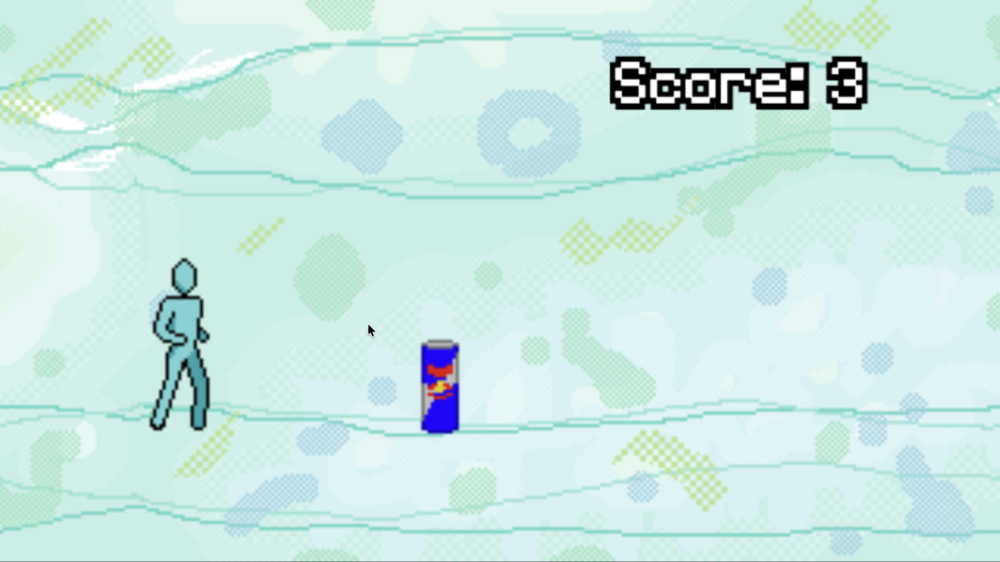

# FruitJump



A fast-paced endless runner game built with PixiJS and TypeScript. Jump over obstacles, rack up points, and see how far you can go as the game progressively gets faster!

Try it out on [GitHub Pages!](https://greghcarr.github.io/fruitjump-pixijs/)

## Overview

FruitJump is an endless runner where you control a character running through a scrolling environment. Time your jumps carefully to avoid obstacles — hit one and it's game over! The longer you survive, the faster the game becomes, testing your reflexes and timing.

The project was built as an exploration of game development concepts using PixiJS as the rendering engine and the PixiJS Sound library for audio.

### Features

- **Parallax scrolling** — multi-layered background scrolls at different speeds, creating depth
- **Animated character** — smooth sprite-based running animation with physics-based jumping
- **Progressive difficulty** — game speed gradually increases as you score more points, capping at a maximum speed
- **Random obstacles** — obstacles appear at varying distances with randomized sprites to keep gameplay unpredictable
- **Music progression** — a sequential music playlist plays through multiple tracks — survive longer to hear more songs
- **Sound effects** — audio feedback for jumping, scoring, and speed increases
- **Responsive scaling** — the game scales and centers itself to fit any screen size while maintaining a 16:9 aspect ratio

## Installation & Setup

You will need [Node.js](https://nodejs.org/) installed.

1. Clone the repository:
```bash
   git clone https://github.com/greghcarr/fruitjump-pixijs.git
   cd fruitjump-pixijs
```

2. Install dependencies:
```bash
   npm install
```

3. Start the development server:
```bash
   npm run dev
```

4. Open your browser and navigate to `http://localhost:5173` (or whichever port Vite assigns).

Press **Space** or **click/tap** to jump. When you hit an obstacle, press **Space** or **click/tap** again to restart.

## How It Works

### Parallax Scrolling

The game features three background layers that scroll at different speeds relative to the game speed. The clouds move slowest (at 1/5 game speed), the main background moves at full game speed, and foreground elements (trees/plants) also move at full speed.

### Player Physics

The player character uses simple physics for jumping: when you jump, an upward velocity is applied, and gravity pulls the character back down each frame. The character can only jump again once they've landed on the ground.

### Obstacle System

Obstacles spawn off-screen to the right at randomized distances (between 200-600 pixels apart) and scroll left at the current game speed. When an obstacle moves off-screen to the left, it's recycled back to the right with a new random sprite and position.

### Collision Detection

Collision detection uses custom hitboxes that are slightly smaller than the visual sprites.

### Progressive Difficulty

Every 25 points, the game speed increases by 0.5 units until reaching a maximum of 16 units.

### Music System

Music plays from a sequential playlist. When one track ends, the next begins automatically. When you restart the game, the music resets to the first track — meaning you need to survive longer to hear the later songs in the playlist.

Programming and Sound Effects by Greg Carr
Art and Music by Sarah Clements